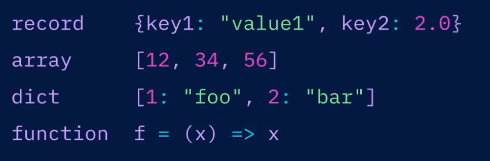

# FLUX

[Back to HOME](https://prone19.github.io/)

### Repos
1. [https://github.com/ushklianik/jmeter-influxdb2-grafana](https://github.com/ushklianik/jmeter-influxdb2-grafana)
2. [https://github.com/kirillyu/jmeterReports2](https://github.com/kirillyu/jmeterReports2)

### Requisites 
* [Grafana + FLUX installation + dashboards](./install)
* [Get Started](https://docs.influxdata.com/flux/v0.x/get-started/)

It's a scripting lang

### Data structure
Contains of multiple tables - *Stream of tables*


A table is a collection of data:

| version | userID | _field | _value |
|---------|--------|--------|--------|
| v1      | ex123  | ex     | 1      |
| v2      | ex123  | ex     | 3      |
| v1      | ex123  | ex     | 4      |

The tables controlled by "Group key:[]" - is a list of columns for any given table:
```
Group key: ["version", "userID"]
```


table1

| version | userID | _field | _value |
|---------|--------|--------|--------|
| v1      | ex123  | ex     | 1      |
| v1      | ex123  | ex     | 4      |

table2

| version | userID | _field | _value |
|---------|--------|--------|--------|
| v2      | ex123  | ex     | 3      |


By default influx groups data by series


SQL - no grouping


### Basic FLUX syntax

`from()` to retrieve data from the data source.  
Pipe-forward operator `(|>)` to send the output of each function to the next function as input.  
`range()`, `filter()`, or both to filter data based on column values.  
`mean()` to calculate the average of values returned from the data source.  
`yield()` to yield results to the user.  

#### data types
 

#### variables
```
varName = VarValue
foo = "bar"
bazRecord = {P}this: 1, that: 8}
data = from (...)
```

#### Reference 
```
#record type
r = {key1: "velue1", key2: 2.0}
r.key1 # use this OR
r["key1"] # or this if key contains spaces for e.g.

#list/array type
arr = [12, 24, 56]
arr[0]

#dictionary
dictEx = [1: "foo", 2: "bar"]
dict.get(dict: dictEx, key: 1, default: "baz") # returns "baz"

```


#### Functions
```
# static function
f = (x, y) => x / y
f(x: 12, y: 2) # returns 6

# Transformations
f = (t=<-) => t #doesn't do anything - take and returs data

# Predicate
(r) => r.key1 == "foo"
(r) => 1.0 == 1.0 # results in true, you can use like ==, !=, <, >, =~, !~ (regex)
(r) => 1.0 > 1.0 and "foo" != "bar" # returns false - it's reading from left to right
```

^resolved to true

There are also `drop` and `keep`, `rename` functions used for dropping and keeping, renaming
columns from your sets of data.

### Basic Query
source ---   
`from (bucket: "system-data)`  
or ---   
```
sql.from( driverName: "postgress",  
                 dataSourceName: "...",  
                 query: "..."
)
```  

or ---   
`csv.from(csv: "...")`

filter --- condition
```
    |> range(start: -h)
    |> filter(fn: (r) =>
      r._measurement == "mem" and
      r._field == "used_percent"
```

shape --- grouping
```
|> group(columns: ["host"])
```

process --- evaluating a value
```
|> mean()
```

`map` function - like filter iterates over all rows in input data and perform *some operations* and returns new modified row.
```
|> map(fn: (r) => ({_time: r._time, _value: r._value})) 
# returns a table with just time and just value
```


```
|> map(fn: (r) => ({r with _value: r._value})) 
# returns initial table with updated _value column
```

When you run an aggregate function
```
data |> mean()
```
It will return aggregate to single value by a table, and time value will drop as it is not a part of group key.


Sum is used in the same way
```
data |> sum()
```

`max()` is not an aggregate func, it's just return max value for each table
```
data |> max()
```

last is the last - same as for max()
```
data |> last()
```

#### Using IF statement


### Examples
```flux
from(bucket: "system-data")
    |> range(start: -h)
    |> filter(fn: (r) =>
      r._measurement == "mem" and
      r._field == "used_percent"
    )
    |> aggregateWindow(every: 5m, fn: mean)

```

```flux
from(bucket: "market-summary")
    |> range(start: -6mo)
    |> filter(fn: (r) =>
      r._measurement == "stockPrices" and
      r.symbol == "GME"
    )
    |> holtWinters(n: 24, seasonality: 12, interval: 1w)

```

pivot is used to add _field values on each row. And then use map to compare temp and hum.


sql data, using join, combining relationa and series data

