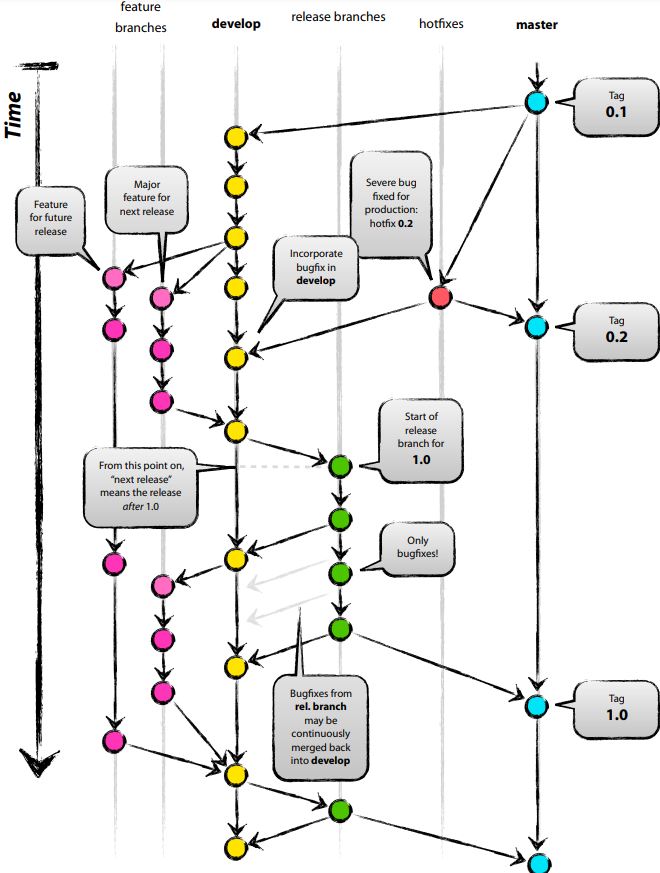
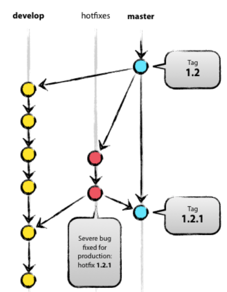

# Git

[Back to HOME](https://prone19.github.io/)

### Git flow (sufficient)
[habr.com/ru/post/106912](https://habr.com/ru/post/106912/)


### Git main theme
Developing new feature create a new branch from development:
```
$ git checkout -b myfeature develop
Switched to a new branch "myfeature"
```
Adding new feature to the develop
```
$ git checkout develop
Switched to branch 'develop'
$ git merge --no-ff myfeature
Updating ea1b82a..05e9557
(Change log)
$ git branch -d myfeature
Deleted branch myfeature (was 05e9557).
$ git push origin develop
``` 
*--no-ff serves to save history of the myfeature branch and the possibility to rollback*

Creating release branches
```
$ git checkout -b release-1.2 develop
Switched to a new branch "release-1.2"
$ ./bump-version.sh 1.2 # potential script to change the version in files
Files modified successfully, version bumped to 1.2.
$ git commit -a -m "Bumped version number to 1.2"
[release-1.2 74d9424] Bumped version number to 1.2
1 files changed, 1 insertions(+), 1 deletions(-)
```
Closing release branch
```
$ git checkout master
Switched to branch 'master'
$ git merge --no-ff release-1.2
Merge made by recursive.
(Change log)
$ git tag -a 1.2
```
Merging changes back to develop
```
$ git checkout develop
Switched to branch 'develop'
$ git merge --no-ff release-1.2
Merge made by recursive.
(Change log)
```
Deleting the release branch
```
$ git branch -d release-1.2
Deleted branch release-1.2 (was ff452fe).
```
Hotfixes:

Created from master branch because develop branch could potentially have
unstable functionality:
```
$ git checkout -b hotfix-1.2.1 master
Switched to a new branch "hotfix-1.2.1"
$ ./bump-version.sh 1.2.1
Files modified successfully, version bumped to 1.2.1.
$ git commit -a -m "Bumped version number to 1.2.1"
[hotfix-1.2.1 41e61bb] Bumped version number to 1.2.1
1 files changed, 1 insertions(+), 1 deletions(-)
```
Commit a hotfix
```
$ git commit -m "Fixed severe production problem"
[hotfix-1.2.1 abbe5d6] Fixed severe production problem
5 files changed, 32 insertions(+), 17 deletions(-)
```
Closing hotfix branches. Merging changes into develop and main.
```
$ git checkout master
Switched to branch 'master'
$ git merge --no-ff hotfix-1.2.1
Merge made by recursive.
(Change log)
$ git tag -a 1.2.1

$ git checkout develop
Switched to branch 'develop'
$ git merge --no-ff hotfix-1.2.1
Merge made by recursive.
(Change log)
```
***if there is a release branch, the hotfix changes should be merged into it instead on develop branch***
...And deleting the branch
```
$ git branch -d hotfix-1.2.1
Deleted branch hotfix-1.2.1 (was abbe5d6).
```

### Git commands
```
git branch
git checkout master
git checkout refactor/autoreport
git add .
git status
git reset requirements.txt
git status
git commit -m "commn" -a
git log
git status
git checkout -b
git checkout -b feature/text.txt
git commit -m "qwe" -a
git checkout refactor/autoreport
git merge --no-ff feature/text.txt
git log
git checkout master
git branch -d refactor/autoreport
git branch -D refactor/autoreport
git branch
git branch -D perf_autoreport
git branch -D feature/text.txt
```