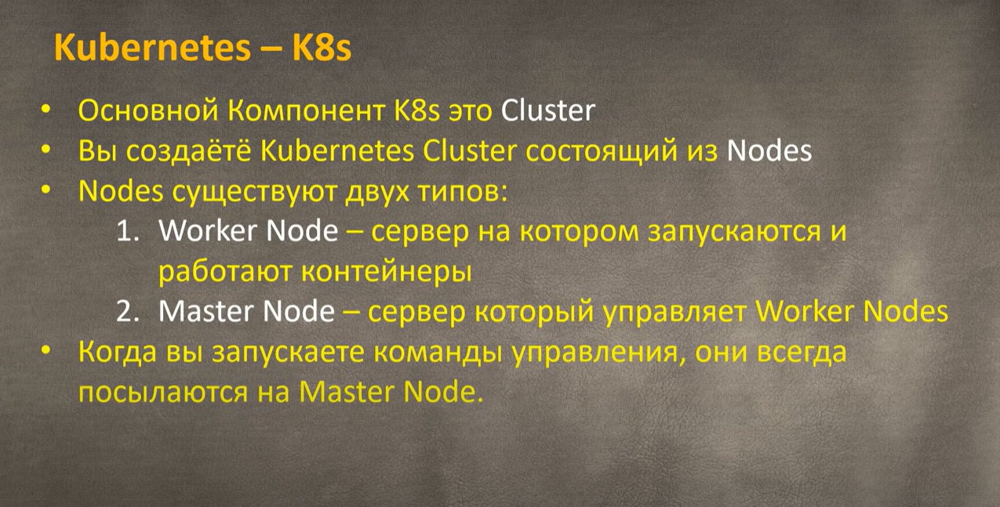
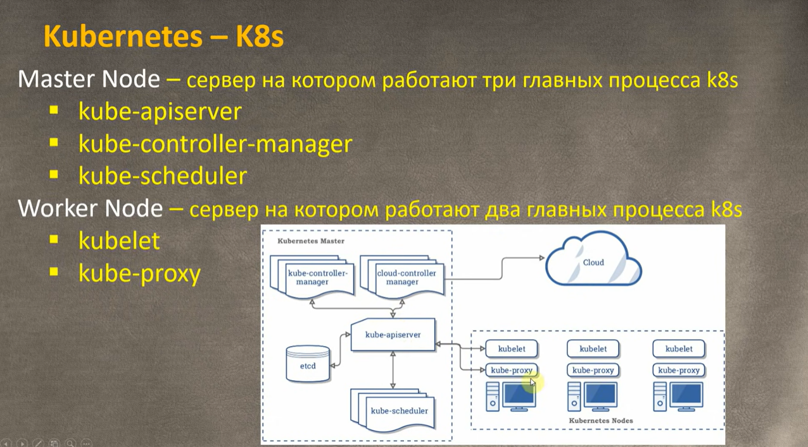
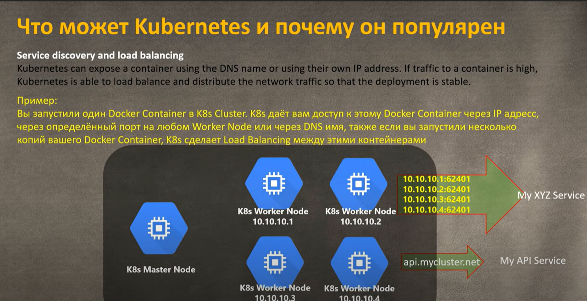
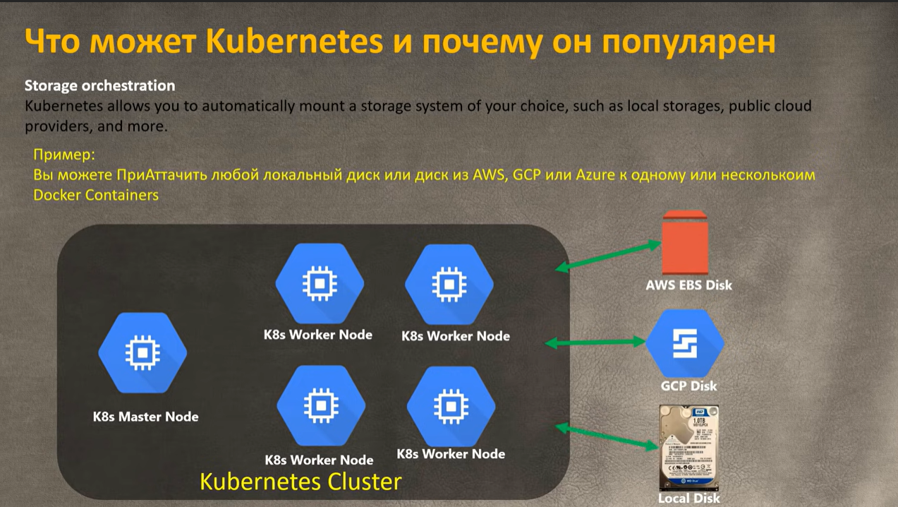
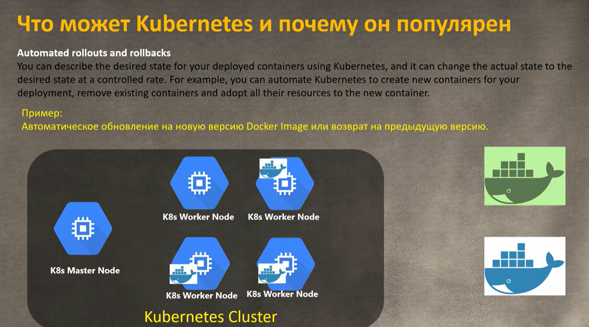
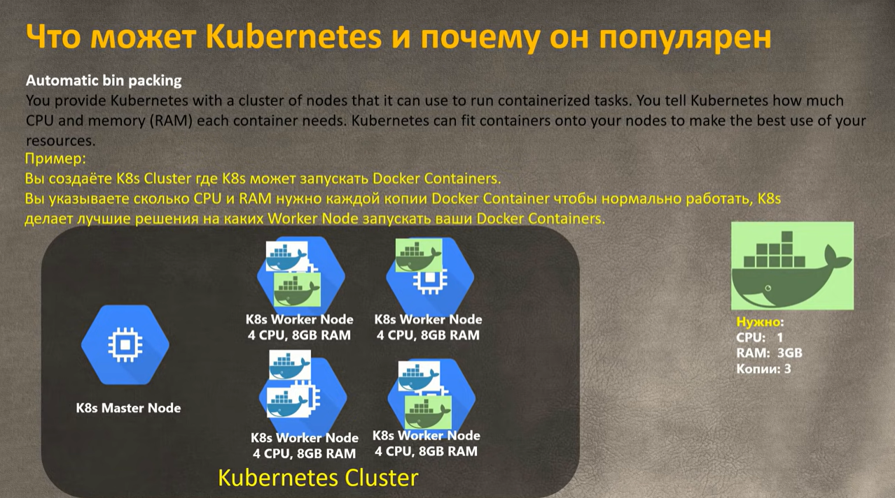
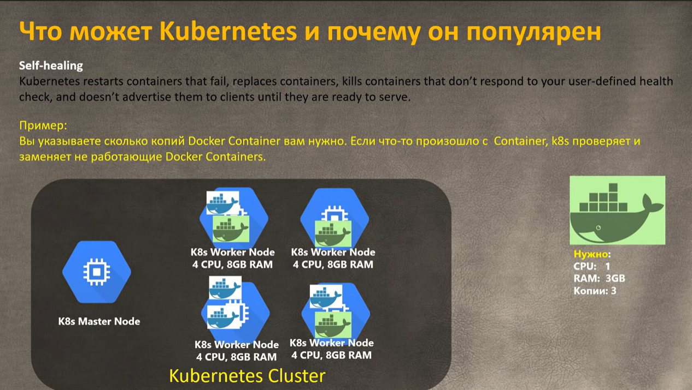
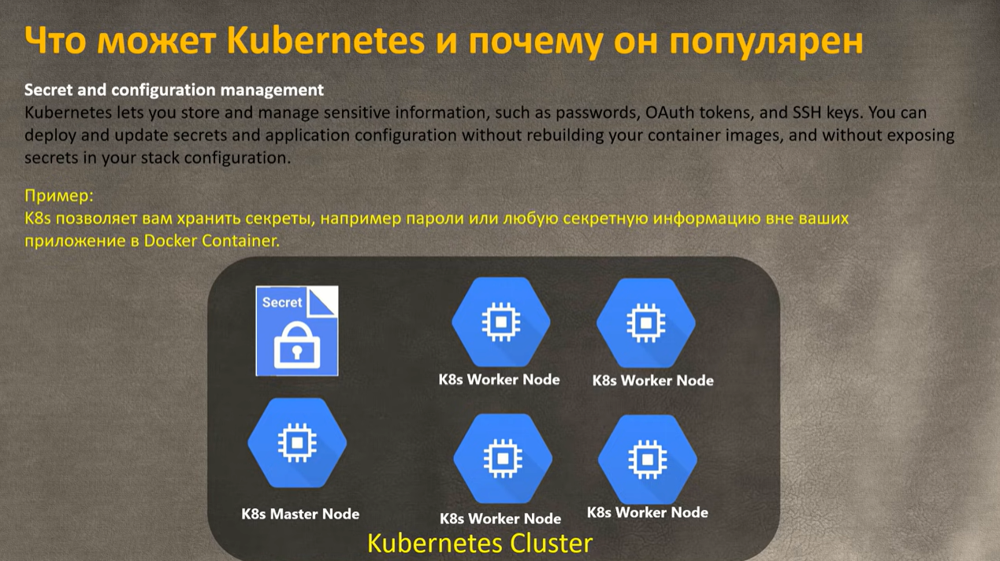
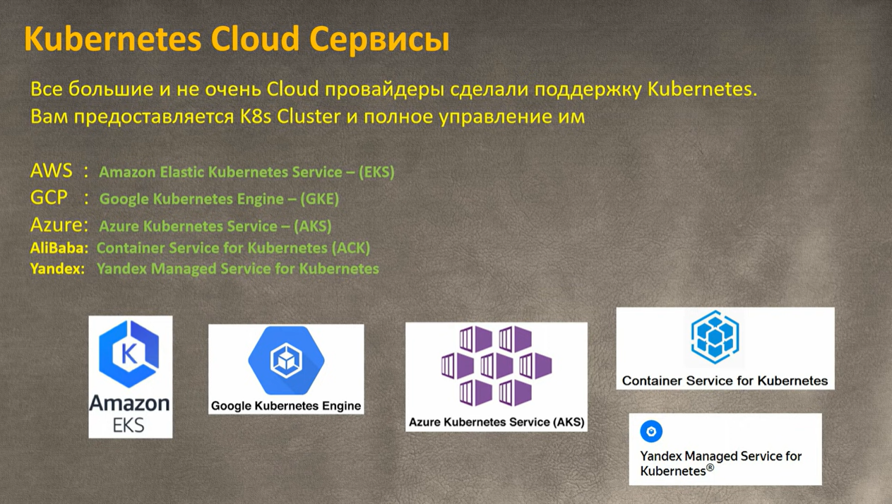

# Perf Theory

[Back to HOME](https://prone19.github.io/)

### Basics
Main component is a cluster:

### Deploy k8s cluster

### play with kubernetes
[https://labs.play-with-k8s.com/](https://labs.play-with-k8s.com/)