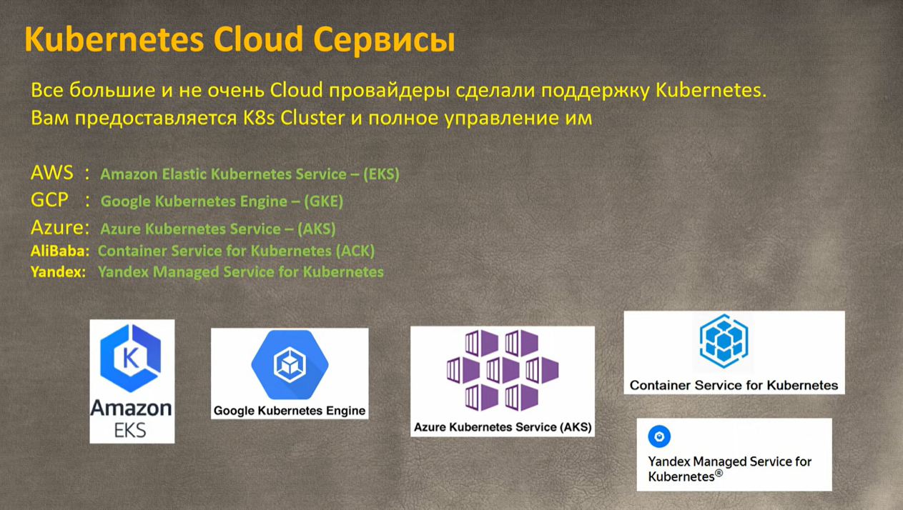

# K8s

[Back to HOME](https://prone19.github.io/)

### Tweaks
[medium - autoscaling-in-kubernetes-why-doesnt-the-horizontal-pod-autoscaler-work-for-me](https://medium.com/expedia-group-tech/autoscaling-in-kubernetes-why-doesnt-the-horizontal-pod-autoscaler-work-for-me-5f0094694054)

### Basics
- [Course ADV-IT - YouTube](https://www.youtube.com/watch?v=q_nj340pkQo&list=PLg5SS_4L6LYvN1RqaVesof8KAf-02fJSi)  
- [Habr - graceful pod stopping](https://habr.com/ru/company/vk/blog/654471/)

Main component is a cluster:




### Main objects in k8s


### Deploy k8s cluster


### play with kubernetes
[https://labs.play-with-k8s.com/](https://labs.play-with-k8s.com/)

### Docker images for k8s


### Deployments


### Services


### Ingress Controller


### Autoscaling (HPA)
[autoscaling - KEDA](https://www.haproxy.com/blog/autoscaling-with-the-haproxy-kubernetes-ingress-controller-and-keda/)
[stackoverflow - an example HPA](https://stackoverflow.com/questions/65342926/kubernetes-autoscaler-where-should-i-specify-scaledown-and-scaleup)
[stackoverflow - formula](https://stackoverflow.com/questions/60959284/kubernetes-deployment-not-scaling-down-even-though-usage-is-below-threshold)
```
desiredReplicas = ceil[currentReplicas * ( currentMetricValue / desiredMetricValue )]
                = ceil[3 * (61/80)]
                = ceil[3 * (0.7625)]
                = ceil[2.2875]
desiredReplicas = 3
```