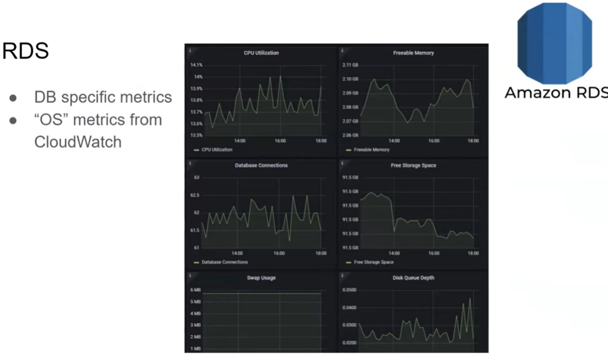

# Monitoring & Reporting

[Back to HOME](https://prone19.github.io/)

## Server Monitoring
[Is it enough to measure CPU, Memory, Disk, Network? - YouTube](https://www.youtube.com/watch?v=4Lm2Ee_YD0U)
[USE method + bottlenecks - YouTube](https://www.youtube.com/watch?v=5sAPrYmuMIs)

#### Analyze types
1. workload - rt across the system (all traces)
2. resources - often there is a lack of some resource  

#### USE method:  
a. utilization (high util - often means bottleneck)  
b. saturation (overload of a resource - see LOAD average metric)  
c. errors (func errors)  
*First look at errors, then saturation, then utilization.*

### CPU: 
* **user** (e.g. jmeter uses 25% and system 70%, so the issues with the system, probably with connections, not with jmeter),
  **system**, **iowait** (useful when app works closely with disk. So high CPU - possibly leads to issues with a DISK. E.g.
  CPU user 20%, iowait 60% - there were no sufficitent number of reads), 
  **steal** (related to VMs - issues with virtuallization, possible issues with resources concurrency. In AWS example - after 
  0.5h of tests rps is degraded, rt grows; amazon locked up to 25% cpu that you can use (25% user, 75% steal))  
  
- USE method for CPU:  
a. util - us, sy, io, si ,st id  
b. saturation - run_queue - lack of cores. Load average includes this run_queue  
often 1 core is overloaded (90%+ and other cores are ~50%), look at si (interruption), if this is the case, go check 
/proc/interrupts | tr -s ' ' | grep eth0-TxRx. All netwoork traffic processed on 0th core  
c. errors -  

load average meaning:
it could be > 100% :)

Load Average:

Load Average is sticked to the number of cores. If Load Average (LA) < 16 (current number of cores) then all fine, = 16 - at the maximum,
 '> 16 processes will be queued (and this is bad :) ) *Load Average is a must have.* 
For e.g. if CPU around 50% but LA is high, look at io queues or wait, network and etc. 

### Memory
* use method for memory:  
  a. util - free, used, cached, buffered
  b. saturation - swapin, swapout, page fault (means that the page was not found in RAM)  
  c. error - malloc() errors - use jmalloc or tcalloc or increase memory  

Not exactly right to look at only free memory, because apps allocate memory also for buffer and cache. And mem usage
can grow but free memory will remain the same while buffer/cache will shrinks.

Check memory usage per process!

### Disk
number of requests  
number of bytes  
RT of request to disk 

USE method for disk:  
a. util - bandwidth, util, r/s, w/s  
b. saturation - iowait, await, avgqu-sz  
c. errors  

### Network
Crucial to check throughput, flat line could be an issue.  
Connections are tricky, they can be not properly reused. Connection limits sometime needs to be increased (not only 
for load generator).

USE method for network  
  a. util - bandwidth, pcki, pcko  
  b. saturation - overruns, dropped  
  c. errors - retransmits  

### Linux vs Windows

### Components:

#### Web-server:

#### Application:

* Monitoring java GC or similar in other applications could be beneficial, for e.g. when memory is growing of hight it 
  doesn't necessarily mean that there is a memory leak OR CPU usage by JAVA is high - is that application or memory is at
  capacity and global GC is working? Continious runs of GC could mean that ther is a memory leak because the GC
  can't release the memory. We can see that if we monitor Java GC and,   etc :)
* Don't test with profiling enabled because it is resource consuming. Use "tracing" instead. Use lightweight monitoring.
*NewRelic, Datadog - can do tracing but costs money.*
  
#### Queue (Rabbit MQ, Kafka):
Used for long operations, sending notifications, and, etc.

* rps messages, received/sent/error
* consumer utilization - e.g. it was 3%, so queue is ready to give 10k rps, but it only give 100, and this consumer is 
the bottleneck (possibly this messages are processed slowly or compressing is slow, etc.)
  
#### Redis (as a cache):
Used for user sessions, cache (requests to DB), for messaging or statistics (rare).

* needs to know how the cache works, how it uses memory and disk.

#### Databases:

Monitor connections, transactions, deadlocks, wait tasks and wait time (what is the issues with requests).
Wait task (parallel dis) - not enough cores to arrange requests that go to database. If a wait task is high, you 
yet know that there is an issue.
Deadlocks is more frequet bottleneck.  

Backups could cause issues with network and database. 

### Cloud Computing:
T-instances in AWS shares their resources between clients, so possibly could be low performance sometime.  

We anyway monitor CPU, Mem, Disk, Network
For e.g. EC2 - VM instance, for e.g.: cloudwatch, stackdriver, azure monitor.  

#### ECS containers - similar to docker compose. But can be scaled, there are microservices here, like hpa.

ECS (in EC2 mode when instance is provided) instance can be monitored; whole docker can be monitored; and docker 
containers can be monitored, also by process.

#### Load balancer distribute load.

#### API gateway (like nginx) is similar to ingress, routing.

*Cloud watch basic limitation that granual is 5 min long by default.*

**Burst Balance** - that is the thing when your component needs to perform more agressive than usual, you can do it (
in AWS for e.g.), but for a limited period of time, and that's why the performance can decrease after say 0.5h of load.
And steal CPU will grow and user cpu will be decreased to 20% for e.g. *As an alternative - unlimited plan.*

#### Autoscaling:

Can be monitored from cloudwatch - see number of containers; it could be seen by cluster or service; cpu util by 
instance and by cluster. 

* Adjusting scaling. Use CPU for scaling nodes. Can be used custom metrics, for e.g. some queues.

#### RDS:

### Monitoring Tools:
$:
* Datadog
* NewRelic
* DynaTrace
* UpDynamics
* Splunk
* ELK stack (free?)

Free:
* Grafana
* influx, prometheus, telegraf
* Zabbix/Nagios (rare)

### Profiling Tools:
- $ss -s  
Potential issues with connections could be seen by $ ss -s command, time-wait means that the connections are not being
closed.

  
- perf, strace, blktrace, systemtap  
e.g. sudo strace -f -c -p $(pgrep process) | magic
