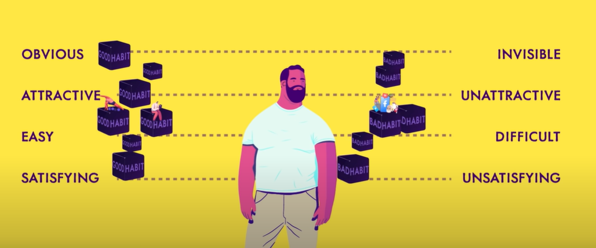

# Soft

[Back to HOME](https://prone19.github.io/)

# Make your communication more efficient and clear
[[source]](https://untools.co/minto-pyramid)

1. Start with the conclusion
Capture your audience's attention early on by first telling them the main takeaway, message, recommendation or simply your conclusion. This may be the opposite to how we've been taught to communicate but it's more efficient, especially in writing and with audiences who have limited time or attention.

    This principle is also called BLUF – "bottom line up front". It originated in the military but is now widely used in the business world.

2. Provide key points
With the main takeaway already communicated, it's time to support it with key arguments or main points. These should still be fairly short. Write them as summaries of your main points. This part should explain the "why" behind your conclusion or recommendation.

3. Support points with detailed information
You might still need to make your key points credible. Do that by giving more detailed information that support them: facts, evidence, numbers, results. This is the part where you can really go into detail if you want to.

    The busier people are, the more likely they are to skip this part but sometimes it's necessary in order for the conclusion to be accepted or acted on.

    Sometimes, you might want to skip the detailed information if your key arguments are enough to justify your conclusion and you know that your audience will understand them well enough.

# Good Habits
[source](https://www.youtube.com/watch?v=PZ7lDrwYdZc)

1. Focus on th person you want to become
2. Make a list with your daily habits and mark them +,- or =
3. Keep habits things (like books) in line of sight. The same for bad habits - leave them out of sight
4. One space - one habit
5. Remove friction for good habits. And bad habits - make them as harder as possible to do
6. Use 2 min rule to stop procrastinating
7. Make it satisfying
8. Don't lose the chain, even in bad days. Do less of the exercise you do, but let it continue
